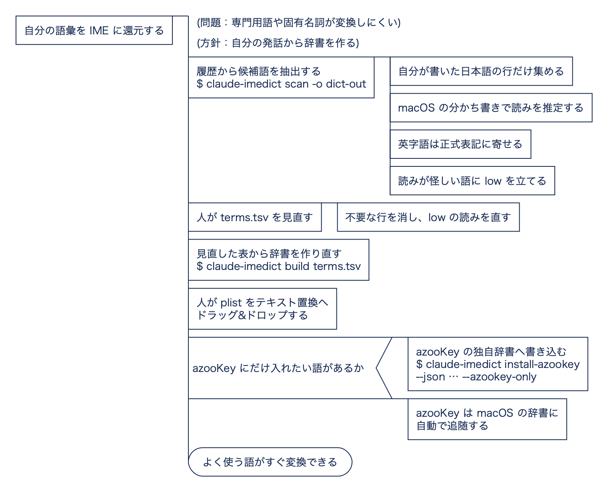

# claude-imedict

Claude Code の対話履歴から、あなたが実際に使っている語彙を抽出して
**macOS 標準のユーザ辞書 (テキスト置換)** と **azooKey (macOS 版)** の
ユーザー辞書を生成するツールです。

対話履歴には、専門用語・固有名詞・プロジェクト固有の言い回しが自然な形で
大量に蓄積されています。それを IME に還元して変換効率を上げることが目的です。

## 考え方

何が問題で、それをどう解いているかを PAD（問題分析図）で示します。各段の詳細は下の各節を参照してください。



<sub>図の元は [`docs/pad/concept.spd`](docs/pad/concept.spd)。[padkit](https://github.com/mashi727/padkit) で検査・描画しています。</sub>

## 特徴

- **依存が最小**: 読みの推定に macOS 内蔵の `CFStringTokenizer` を使うため、
  MeCab や外部辞書のインストールが不要。日本語の単語分割と読み推定を
  OS の機能だけで行います (漢字語の読み推定成功率は実測 99.9%)。
  実行時依存は PyObjC のみです。
- **ユーザー自身が書いた文だけを対象**: ツール実行結果、添付ファイル、
  コードブロック、貼り付けたログ、Claude の応答は語彙源から除外します。
- **英字語は正式表記に寄せる**: `luatex` と打って `LuaTeX` が出るように、
  大文字小文字の揺れを束ねて正式表記側を採用します。
- **頭字語はかな読みも生成**: `URL` に `url` と `ゆーあーるえる` の
  両方の読みを与え、英数入力・かな入力のどちらからでも引けます。
- **読みが怪しい語に印**: 文脈で読みが変わる形態素を含む語 (例:「次」)
  には `confidence=low` を立て、目視レビューを促します。

## インストール

[uv](https://docs.astral.sh/uv/) で管理しています (macOS 専用)。

**コマンドとして常用する場合**

```sh
uv tool install --from tools/integrated/claude-imedict claude-imedict
```

以降 `claude-imedict` をどこからでも実行できます。更新は
`uv tool upgrade claude-imedict`、削除は `uv tool uninstall claude-imedict`。

**このリポジトリ内で開発・実行する場合**

```sh
cd tools/integrated/claude-imedict
uv sync                       # .venv を作り依存を解決 (uv.lock に固定)
uv run claude-imedict --help
```

`uv run` は実行前に環境を自動同期するので、`uv sync` は初回のみで構いません。
以下の例では `claude-imedict` と書きますが、リポジトリ内で動かす場合は
`uv run claude-imedict` に読み替えてください。

## 使い方

### 1. 履歴を解析して候補語を作る

```sh
claude-imedict scan -o dict-out
```

`dict-out/` に 4 つのファイルが生成されます。

| ファイル | 用途 |
| --- | --- |
| `terms.tsv` | 目視レビュー用の一覧 (出現数・プロジェクト数・確度つき) |
| `macos-user-dictionary.plist` | macOS 標準ユーザ辞書の取り込み用 |
| `azookey-user-dictionary.json` | azooKey へのマージ用 |
| `azookey-user-dictionary.csv` | azooKey の CSV 取り込み用 |

### 2. レビューする (推奨)

`terms.tsv` をスプレッドシートやエディタで開き、**不要な行を削除**、
`confidence` が `low` の行は読みを直すか削除します。列は
`reading / word / count / projects / kind / confidence` で、
`#` で始まる行と空行は無視されます。

```sh
claude-imedict build terms.tsv -o dict-out
```

レビュー後の TSV から辞書ファイルを作り直します。読みを自分で書き足した
行を追加しても構いません。

### 3. 取り込む — macOS へ入れるだけでよい

システム設定 → キーボード → テキスト入力 → 「テキスト置換」を開き、
`macos-user-dictionary.plist` をリストへドラッグ&ドロップします。

**azooKey へは自動で反映されます。** azooKeyMac は macOS ユーザ辞書の実体である
`~/Library/KeyboardServices/TextReplacements.db` を直接読み
(`SELECT ZSHORTCUT, ZPHRASE FROM ZTEXTREPLACEMENTENTRY`)、KeyboardServices
ディレクトリの変更を監視して追随します。読み込んだ内容は azooKey の
`...preference.system_user_dictionary` に保持されます。設定は不要です。

`azookey-user-dictionary.json` / `.csv` は、**OS と共有しない運用**
(azooKey にだけ入れたい語がある場合) のための予備です。

<details>
<summary>azooKey 独自辞書へ直接入れる場合</summary>

```sh
claude-imedict install-azookey --json dict-out/azookey-user-dictionary.json --azookey-only
```

`--azookey-only` が無いと、二重登録になる旨を表示して中断します。macOS 側にも
同じ語がある状態で実行すると、`system_user_dictionary` 経由で届く語と重複します。

既存エントリを保持したまま追記し (読みと表記が同じ組はスキップ)、書き込み前に
plist のバックアップを取ります。azooKey が動作中だと終了時にメモリ上の内容で
plist が上書きされるため実行は拒否されます。入力ソースを他の IME に切り替えるか
`--force-quit` を付けてください。`--dry-run` で件数だけ確認できます。

</details>

## 主なオプション

```
--min-count N          最低出現回数 (既定: 3)
--min-projects N       最低出現プロジェクト数 (既定: 1)。2 以上にすると
                       特定プロジェクトの貼り付け由来のノイズが減ります
--min-length N         語の最短文字数 (既定: 3)
--limit N              出力語数の上限 (既定: 500)
--ascii-reading MODE   英字語の読み lower / letters / both (既定: both)
--exclude-existing     azooKey・macOS に既登録の語を除外
--include-assistant    Claude の応答も語彙源に含める
--no-history           ~/.claude/history.jsonl を使わない
--keep-ascii-lines     日本語を含まない行も語彙源にする
--claude-dir PATH      Claude Code のデータディレクトリ (既定: ~/.claude)
```

## 仕組みと限界

**語彙源**
`~/.claude/projects/*/*.jsonl` の `type: "user"` レコードと、
`~/.claude/history.jsonl` の `display` (プロンプト欄に打った文字列そのもの)
を使います。既定では日本語文字を含まない行を捨てます。日本語話者の
プロンプトにおける全 ASCII の行は、ほぼ貼り付けたログ・コマンド・パスで
あり語彙源として有害なためです。有用な英字語は日本語の文中にインラインで
現れるので取りこぼしません。

**読みの推定**
`CFStringTokenizer` に `kCFStringTokenizerAttributeLatinTranscription` を
指定するとトークンごとのローマ字読みが得られます (協奏 → `kyousou`)。
これをワープロ式ローマ字としてひらがなへ逆変換します。ICU 固有の綴り
(小書き仮名の `~tsu`、四つ仮名の `dzu`) も扱います。中国語読みへ
フォールバックした場合は綴りが変換表に載らないため自動的に棄却されます。

**限界**
- 単漢字の読みは文脈依存で、推定を誤ることがあります
  (「次セッション」→ `じせっしょん`。正しくは `つぎせっしょん`)。
  こうした語には `confidence=low` が立つので、レビューで直してください。
- 「IME の標準辞書に既にある語」を機械的に判定する手段が macOS にないため、
  一般語の除外は同梱の除外リスト (`stoplist.py`) と出現頻度によるヒューリ
  スティックに依っています。取りこぼした一般語はレビューで削ってください。
- azooKey の CSV 取り込みの列順は公開仕様が確認できなかったため、
  UserDefaults 上の JSON スキーマに合わせて `word, reading, hint` の順で
  出力しています。CSV が期待通りに読まれない場合は `install-azookey`
  (JSON を plist へ直接マージ) を使ってください。

## 保存先の実体

| 対象 | 場所 |
| --- | --- |
| macOS 標準（**一次情報源**） | `~/Library/KeyboardServices/TextReplacements.db` のテーブル `ZTEXTREPLACEMENTENTRY` (列 `ZSHORTCUT` / `ZPHRASE`) |
| macOS 標準（ミラー） | `NSGlobalDomain` の `NSUserDictionaryReplacementItems` |
| azooKey（OS 辞書の取り込み結果） | azooKey plist のキー `...preference.system_user_dictionary` |
| azooKey（独自辞書） | 同 plist のキー `...preference.user_dictionary_temporal2` |

azooKey plist の場所は
`~/Library/Containers/dev.ensan.inputmethod.azooKeyMac/Data/Library/Preferences/dev.ensan.inputmethod.azooKeyMac.plist`
で、いずれの値も JSON 文字列 `{"items":[{word, reading, hint, id}]}` です。

**`NSGlobalDomain` は古いミラーで、実際より少ない件数しか返さないことがあります**
(実測で DB 62 件に対し 5 件)。`--exclude-existing` は DB を一次情報源とし、
読めない場合のみ `NSGlobalDomain` にフォールバックします。DB は読み取り専用で開きます。

## テスト

```sh
uv run pytest tests -q
```

pytest は `[dependency-groups]` の `dev` グループに入っており、`uv run` が
自動で用意します。

## ライセンス

MIT
